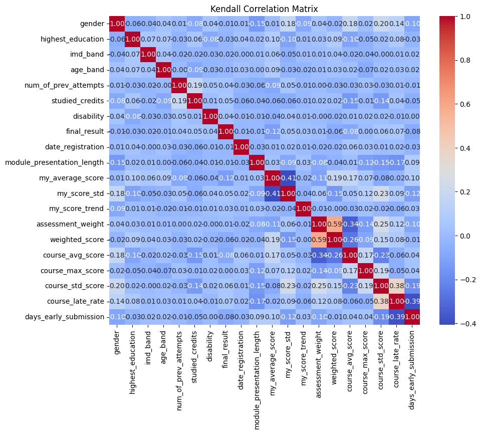
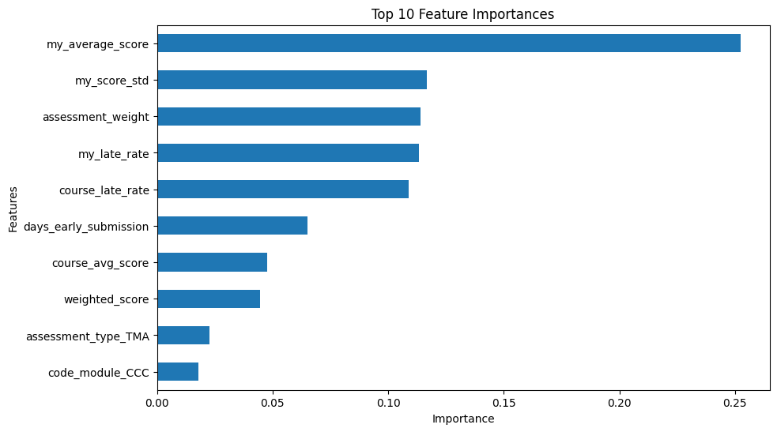
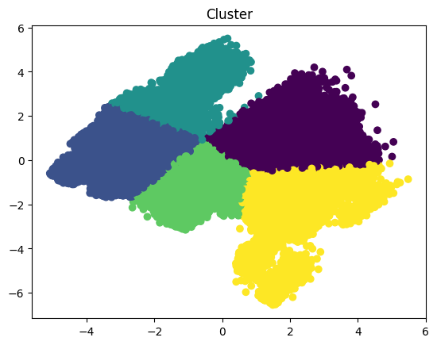
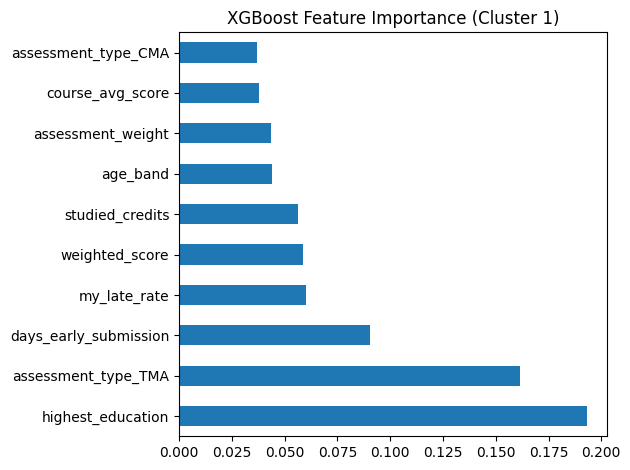
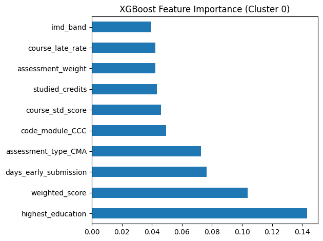
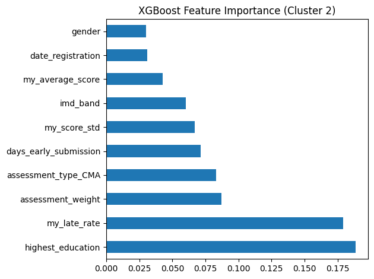
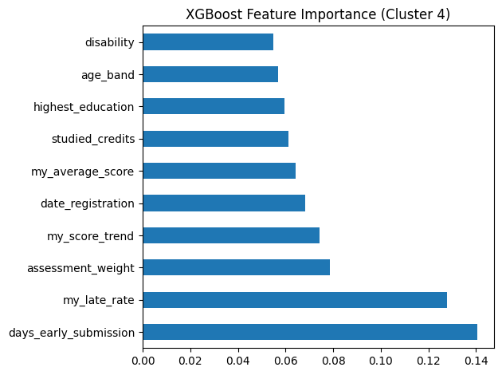
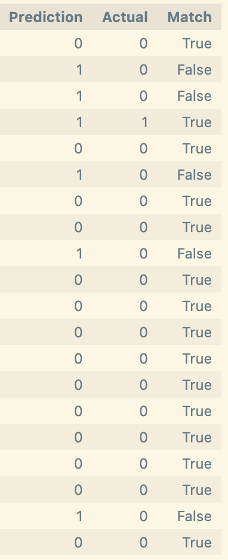
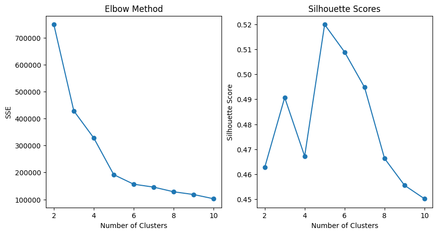
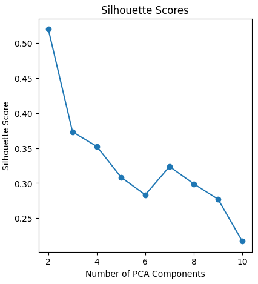

**📅개발 기간: 2025.03.31 ~ 2025.04.01**
# 🎓 대학교 수강 이탈 예측 모델링

## 🏃‍♂️ 팀원 소개
- **SK 네트웍스 Family AI 캠프 11기**

- **팀명:** **6조**
---

|[@백미송](https://github.com/misong-hub)|[@김성지](https://github.com/kimseoungji0801)|[@이채은](https://github.com/chaeeunlee05)|[@이혜성](https://github.com/comet39)|[@홍성욱](https://github.com/Sung-WookHong)|
|------|------|------|------|------|
|  |  |  |  |  |


---

## 🔧 기술 스택

  

## 데이터 분석
<p align="">
  
  
  
</p>

## 시각화
<p align="">
  
  
</p>

---

## 목차   
1. 프로젝트 개요   
    1) 프로젝트 목표   
    2) 데이터셋 
2. 탐색적 데이터 분석 (EDA)   
    1)    
3. 학생 이탈 예측 모델 학습   
    1)   
4. 학생 정보 기반 맞춤형 교육과정 설계
5. Appendix
   
<br>

---

## 1. 🔍 프로젝트 개요
### 1) 📌 프로젝트 목표
 * Open University의 실제 데이터셋을 활용하여 수강 철회 결정에 영향을 미치는 주요 요인 분석
 * 수업 난이도, 학생의 기본 정보, 과제 제출 패턴 등을 종합적으로 분석해 수강 철회 확률 예측
 * 신규 수강생의 데이터를 기반으로 수강 철회 가능성을 조기에 예측하고, 맞춤형 교육과정 설계방안 제시

### 2) 📂 데이터셋    
 * 데이터 개요   
   영국 Open University에서 공개한 대표적인 공개 데이터: [Open University Learning Analytics Dataset (OULAD)](https://analyse.kmi.open.ac.uk/#open-dataset)
 * 데이터 구성
    1. `assessments.csv` : 각 강의에서 제공되는 과제 및 평가 관련 세부 정보 <br/>
    2. `courses.csv`: 개설된 각 강의의 식별자, 강의명 등 강의 기본 정보 <br/>
    3. `studentAssessment.csv`: 학생들의 과제 제출 이력과 성적 데이터를 포함한 학습 성과 정보 <br/>
    4. `studentInfo.csv` : 각 학생의 인구통계학적 특성(성별, 연령, 최종 학력 등) <br/>
    5. `studentRegistration.csv`: 학생들의 수강 신청 내역과 각 강의에 대한 철회 여부 <br/>
 * 5개의 csv 파일을 `학생 ID(id_student)`, `과목 코드(code_module)`, `학기(code_presentation)`를 기준으로 병합
 * 최종 병합된 데이터에 포함된 컬럼  cf.) [제거된 컬럼 명 확인](#불필요한-컬럼-제거)    
표 1.1 원본 데이터에 포함된 주요 컬럼 항목

| 컬럼명                     | 설명                                                               |
|----------------------------|-------------------------------------------------------------------|
| gender                     | 학생의 성별 (남성, 여성)                                           |
| highest_education          | 학생의 최고 학력 수준 (고등학교, 학사, 석사)                       |
| imd_band                   | 학생이 속한 지역의 사회경제적 지위                                 |
| age_band                   | 학생의 연령대                                                     |
| disability                 | 학생의 장애 여부                                                  |
| studied_credits            | 학생이 현재까지 이수한 학점 수                                    |
| num_of_prev_attempts       | 해당 과목의 과거 수강 이력 횟수                                   |
| date_registration          | 학생이 등록한 날짜                                               |
| module_presentation_length | 강의의 전체 길이                                                 |
| assessment_weight          | 각 평가 항목이 성적에 미치는 비중                                 |
| final_result               | 최종 결과 (Pass, Fail, Withdrawn)                                |

<br>
<br>

표 1.2 초기 데이터 컬럼을 기반으로 계산된 신규 컬럼 항목    
| 컬럼명                     | 설명                                                                 |
|----------------------------|----------------------------------------------------------------------|
| my_average_score           | 특정 학생의 평균 점수                                               |
| my_score_std               | 특정 학생의 점수 표준편차                                           |
| my_score_trend             | 특정 학생 점수의 변화 추이 (상승, 하락)                             |
| weighted_score             | 평가 가중치를 반영한 환산 점수                                      |
| course_avg_score           | 특정 과목 수강생들의 평균 점수                                      |
| course_max_score           | 특정 과목 수강생 중 최고 점수                                       |
| course_std_score           | 특정 과목 수강생들의 점수 표준편차                                  |
| course_late_rate           | 해당 과목에서 전체 학생의 지각 제출 비율                            |
| days_early_submission      | 마감일 기준으로 과제를 조기 제출한 일 수                            |
| my_late_rate               | 해당 학생의 전체 과제 중 지각 제출한 과제 비율                       |

<br>

## 2. 📊 탐색적 데이터 분석 (EDA)

## 1) 결측치 및 이상치 처리

### `date`

- `assessment_type = "Exam"` → `module_presentation_length`를 활용해 **강의 마지막 날짜로 채움**


### `score`, `imd_band`

- 전체 데이터 대비 결측치 수가 적으므로 **삭제 처리**


### `date_unregistration`

- 결측치 160,857건
- 해당 컬럼은 **"언제 수강을 중도 이탈했는가"**를 의미
→ **결측 = 중도 이탈하지 않은 수료자**

### `final_result 이상치 처리`

````
df = df.drop(df[(df['final_result'] == 'Fail') & (df['date_unregistration'] >= 0)].index)
````

- **`final_result`** 는 학생의 최종 성적 결과를 나타냅니다. **`date_unregistration`** 이 존재하는 경우(즉, 학생이 이탈한 경우), 해당 학생은 **`Fail`** 상태로 결과가 나올 수 없으므로 이상치라고 판단하여 drop


## 2.인코딩


### 불필요한 특성 제거
   - 분석에 불필요하거나 중복되는 정보를 가진 열 제거


## 3. 특성 엔지니어링
#### 학생의 성적 관련 특성
  - 각 학생의 평균 점수, 최고 점수, 최저 점수, 점수의 표준편차
    - 각 학생당 코스별 성적 편차 필요할까?
  - 점수 추세 (상승 또는 하락)
  - 과제 난이도에 따른 가중 점수 부여

#### 코스 관련 특성
  - 코스별 평균 점수, 최고 점수, 최저 점수, 점수의 표준편차
  - 코스별 과제 개수

#### 행동 패턴 특성
  - 과제 제출률
  - 지각 제출 비율
  - 과제별 제출 시간의 평균, 중앙값, 표준편차

## 4. StandardScaler 적용 (정규화)
- 수치형 변수에 대해 표준화 또는 정규화 적용

---

# 📊 탐색적 데이터 분석 (EDA)

### 변수별 행동 분석 시각화: `과제 점수 비중 assessment_weight` (예시)


- 데이터가 수직적으로 랜덤하게 분포해 있어, 의미 있는 경향성이 없다는 것을 시각적으로 확인 가능
- assessment_weight 분포는 Dropout 여부(0 vs 1)에 상관없이 유사

- 학생의 이탈 여부는 단일 수치 변수로 설명되지 않으며, **학생의 행동 기반 요인들은 매우 랜덤하게 작용함.**
- 본 데이터셋 내 다른 변수들과 마찬가지로 **단편적인 변수만으로 이탈을 예측하는 데 한계가 있음**을 시사하며, 보다 **복합적인 요인들의 통합 분석이 필요함.**


### 개인정보 여부에 따른 수강 이탈자 비율 (Withdrawn)

1. **Gender (성별)**: 성별에 따른 "withdrawn" 상태의 비율
2. **Age Band (연령대)**: 연령대별로 "withdrawn" 상태의 비율
3. **Disability (장애 여부)**: 장애 여부에 따른 "withdrawn" 상태의 비율
4. **Highest Education (최고 학력)**: 최고 학력에 따른 "withdrawn" 상태의 비율


## 히트맵(상관행렬)을 분석

- 히트맵(상관행렬)을 분석했을 때, 특정 변수들 간의 선형적 상관관계(피어슨 상관계수)가 낮게 나왔지만, 여전히 타겟 변수와의 관계가 존재할 가능성이 있으면 비선형 상호작용을 탐색을 하기로 함

## 비선형 데이터 특성 중요도 분석 기법
### 1. Spearman 상관계수 시각화
- 비선형 관계를 가진 변수 간 순위 기반 상관성을 측정


### 2. RandomForestClassifier를 특성 중요도 시각화
- 여러 개의 결정 트리를 만들어 데이터를 학습하고, 각 특성이 예측에 얼마나 기여했는지를 계산


### 3. Kendall 상관계수 시각화
- 두 변수 간의 순위가 얼마나 일치하는지를 측정



### 4. GradientBoostingClassifier를 통한 특성 중요도 시각화
- 특성 간의 복잡한 관계를 학습하며, 어떤 특성이 중요한지를 계산



---

# ⚙️ 모델링

## **모델링 개요**
### 🚨 학생 이탈 조기 예측

1. 앙상블, 클러스터링을 통해 기본적인 이탈 예측 모델을 생성한다.
2. 협업 필터링을 통해 새로운 학생과 유사한 패턴을 보이는 학생들을 추출한다.
    - 이때 새로운 학생의 정보가 어디까지 있어야 협업 필터링이 유의미할지는 eda를 통해 도출
        - **학생 기본 데이터** : 나이, 성별, 경제수준, 장애여부 등
        - **학업 데이터**: 과제 제출률, 시험 성적, 과목 난이도 등
        - **행동 데이터**: 지각 제출 비율, 이탈 학생의 이탈 단계 등
3. 만들어진 모델을 통해 새 학생이 어떤 조치를 했을 때 이탈을 하지 않을지 예측한다.
4. 추후 개발 : 자동 경고 시스템 구축 (예: 학습 참여도가 일정 임계값 이하로 떨어지면 교수자 및 학생에게 알림)

## **클래스 불균형 문제**

- **클래스 0 (비이탈자)** 는 잘 맞추고 있음 (recall=1.00).
- **클래스 1 (이탈자)** 는 recall이 0.28, 즉 이탈자를 정확히 잡아내지 못하고 있음.
- 전반적으로 **정확도 95%** 는 높지만, 이는 다수 클래스인 0에 의존한 착시.

   ### ⬆️ 오버샘플링
   - 클래스 불균형 처리: SMOTE를 통해 **이탈자 수(1)** 를 오버샘플링하여 균형 잡힌 학습 데이터셋 구성
     
     
   
   - recall이 0.28 → 0.52로 크게 상승 → **이탈자를 훨씬 더 많이 잡아냄.**
   - precision은 줄었지만 이는 이탈자 예측을 더 시도했기 때문에 자연스러운 현상.
   - f1-score도 올라서 **균형 잡힌 예측 성능 향상.**
   
   
   ### ⬇️ 언더샘플링
   - 클래스 불균형 처리: **언더샘플링**으로 **이탈자 수(1)** 에 맞춰 비이탈자 수 조정
 
     
    - Recall이 0.28 → 0.87로 크게 상승 **이탈자를 훨씬 더 잘 잡아냄 (실제 이탈자 중 예측된 비율이 상승)** <br/>
    - Precision은 감소했지만 자연스러운 현상 <br/>
    - F1-score는 약간 하락했지만, 전체적인 목표가 **‘이탈자를 놓치지 않는 것’** 이라면 매우 유의미한 개선 <br/>
    - Accuracy는 줄었지만 이는 클래스 불균형 완화로 인한 변화 → 전체 정확도보다 이탈자 예측 성능이 더 중요한 상황에서는 좋은 방향 <br/>


  ### 결론
  - 언더샘플링 기법을 통해 클래스 불균형 문제를 해결 하는 것이 모델 성능 향상율이 높으므로 앞으로의 모델 학습에 언더샘플링 기법을 사용합니다.

## 1. 앙상블 모델

### 🧑‍🧑‍🧒‍🧒 협업 필터링을 활용한 신규 학생 이탈 예측
협업 필터링을 통해 유사한 패턴을 보이는 학생들을 추출하고 앞서 개발한 앙상블 모델을 활용하여 새로운 학생의 이탈 예측합니다.

## 2. 클러스터 기반 분류 모델

### 📌 개요
클러스터 기반의 이진 분류 모델을 사용하여 새로운 학생의 데이터가 들어왔을 때 이탈을 예측합니다. 비지도 학습(클러스터링)과 지도 학습(분류 모델)을 결합하여, 서로 다른 학생 그룹에 특화된 예측 모델을 생성하는 방식으로 설계되었습니다.

### 👥 클러스터링 + 이진 분류 모델

- 앙상블 모델을 통한 최종 이진 분류 모델 선택 👉 **XGBoost**
     - 그래디언트 부스팅의 순차적 오류 수정
     - 클래스 불균형 대응력 (under sampling과의 시너지)
    - 이유.. 적기
```
1. 데이터 스케일링 및 PCA를 통해 데이터를 2차원으로 축소
2. K-means 클러스터링을 통한 군집화
3. 각 클러스터에 대해 별도의 XGBoost 모델 
4. 각 클러스터 id 기준으로 모델과 스케일러를 저장
```

### 🪄 이탈 예측 프로세스
```
1. 새로운 학생 유입
2. 내 클러스터은 어디? (id)
3. 내 클러스터 id에 해당하는 모델을 사용
4. 새로운 학생의 최종 이탈 예측 확인
```

### 📊 결과 분석
#### 클러스터 분포 통계 확인



#### 각 클러스터별 특징 중요도 분석





#### 클러스터 별 모델 학습
````
🚀 클러스터 4 모델 학습 시작...
리샘플링 후 클래스 분포:
0: 2573개 | 1: 2573개

✅ 학습 정확도: 0.9951409135082604
✅ 테스트 정확도: 0.829126213592233

📋 분류 성능 보고서 (테스트셋):

              precision    recall  f1-score   support

           0       0.85      0.79      0.82       515
           1       0.81      0.86      0.83       515

    accuracy                           0.83      1030
   macro avg       0.83      0.83      0.83      1030
weighted avg       0.83      0.83      0.83      1030


🚀 클러스터 0 모델 학습 시작...
리샘플링 후 클래스 분포:
0: 4894개 | 1: 4894개

✅ 학습 정확도: 0.9948914431673053
✅ 테스트 정확도: 0.839632277834525

📋 분류 성능 보고서 (테스트셋):

              precision    recall  f1-score   support

           0       0.87      0.80      0.83       979
           1       0.81      0.88      0.85       979

    accuracy                           0.84      1958
   macro avg       0.84      0.84      0.84      1958
weighted avg       0.84      0.84      0.84      1958


🚀 클러스터 2 모델 학습 시작...
리샘플링 후 클래스 분포:
0: 887개 | 1: 887개

✅ 학습 정확도: 0.9950669485553206
✅ 테스트 정확도: 0.856338028169014

📋 분류 성능 보고서 (테스트셋):

              precision    recall  f1-score   support

           0       0.90      0.80      0.85       178
           1       0.82      0.92      0.86       177

    accuracy                           0.86       355
   macro avg       0.86      0.86      0.86       355
weighted avg       0.86      0.86      0.86       355


🚀 클러스터 3 모델 학습 시작...
리샘플링 후 클래스 분포:
0: 2545개 | 1: 2545개

✅ 학습 정확도: 0.9945972495088409
✅ 테스트 정확도: 0.7907662082514735

📋 분류 성능 보고서 (테스트셋):

              precision    recall  f1-score   support

           0       0.81      0.75      0.78       509
           1       0.77      0.83      0.80       509

    accuracy                           0.79      1018
   macro avg       0.79      0.79      0.79      1018
weighted avg       0.79      0.79      0.79      1018


🚀 클러스터 1 모델 학습 시작...
리샘플링 후 클래스 분포:
0: 1055개 | 1: 1055개

✅ 학습 정확도: 0.9869668246445498
✅ 테스트 정확도: 0.8080568720379147

📋 분류 성능 보고서 (테스트셋):

              precision    recall  f1-score   support

           0       0.87      0.73      0.79       211
           1       0.77      0.89      0.82       211

    accuracy                           0.81       422
   macro avg       0.82      0.81      0.81       422
weighted avg       0.82      0.81      0.81       422


🎉 모든 클러스터 학습 완료!
`````

##### 예측 실행 시 정확도



새로운 학생 데이터 7개에 대한 예측 정확도는 85.71%

### 💡 클러스터링 모델 개선 

#### 개요
데이터의 특성과 클러스터링 알고리즘에 따라 클러스터 개수 및 PCA 컴포넌트 개수가 클러스터링 성능에 영향을 미칠 수 있어서 다음과 같은 시각화를 통해 최적의 파라미터를 탐색

#### 최적의 클러스터 개수 찾기(엘보우 메서드, 실루엣 분석 활용)

- 4~5개의 클러스터가 데이터 분류에 가장 적합

#### 최적의 PCA 컴포넌트 개수 찾기(실루엣 분석 활용)

- 2개의 PCA 컴포넌트를 사용할 때 가장 높은 Silhouette Score를 기록하므로, 이 경우가 최적의 선택

## 🎯 하이퍼파라미터 튜닝

### 1. 앙상블 (기본)
   - Voting 방식: Hard Voting
   → 로지스틱 회귀, DecisionTreeClassifier, XGBoost의 다수결 투표로 최종 예측을 결정하는 기본 앙상블 방식.
   ```python
   VotingClassifier(
       estimators=[
           ('lr_clf', LogisticRegression()),
           ('dt_clf', DecisionTreeClassifier()),
           ('xgb_clf', XGBClassifier())
       ],
       voting='hard'
   )
   ```
   

### 2. 앙상블 + GridSearchCV 
   - Voting 방식: Soft Voting + 하이퍼파라미터 튜닝(GridSearchCV)
   → 각 모델을 GridSearchCV로 튜닝한 후 soft voting 방식으로 예측 확률 평균을 기반으로 최종 예측을 수행.
   ```python
   # 4. Logistic Regression 튜닝
   lr_param_grid = {
       'C': [0.01, 0.1, 1, 10],
       'penalty': ['l2'],
       'solver': ['lbfgs'],
       'max_iter': [100, 500, 1000]
   }
   lr_grid = GridSearchCV(LogisticRegression(), lr_param_grid, scoring='f1', cv=3, verbose=1, n_jobs=-1)
   lr_grid.fit(X_train, y_train)
   best_lr = lr_grid.best_estimator_
   
   # 5. Decision Tree 튜닝
   dt_param_grid = {
       'max_depth': [5, 10, 15],
       'min_samples_split': [2, 5, 10],
       'criterion': ['gini', 'entropy']
   }
   dt_grid = GridSearchCV(DecisionTreeClassifier(random_state=42), dt_param_grid, scoring='f1', cv=3, verbose=1, n_jobs=-1)
   dt_grid.fit(X_train, y_train)
   best_dt = dt_grid.best_estimator_
   
   # 6. XGBoost 튜닝
   xgb_param_grid = {
       'n_estimators': [50, 100, 150],
       'max_depth': [3, 5, 7],
       'learning_rate': [0.01, 0.05, 0.1],
       'subsample': [0.7, 0.8, 1.0],
       'colsample_bytree': [0.7, 0.8, 1.0]
   }
   xgb_grid = GridSearchCV(XGBClassifier(use_label_encoder=False, eval_metric='logloss', random_state=42), xgb_param_grid, scoring='f1', cv=3, verbose=1, n_jobs=-1)
   xgb_grid.fit(X_train, y_train)
   best_xgb = xgb_grid.best_estimator_
   ```
   

### 3. 앙상블 + RandomizedSearchCV
   - Voting 방식: Soft Voting + 하이퍼파라미터 튜닝(RandomizedSearchCV)
   → 모델별로 랜덤 탐색 기반 튜닝(RandomizedSearchCV) 후 soft voting으로 예측 확률 평균을 활용하여 예측.
   ```python
   # 4. RandomizedSearchCV - Logistic Regression
   lr_param_dist = {
       'C': uniform(0.01, 10),
       'penalty': ['l2'],
       'solver': ['lbfgs'],
       'max_iter': [100, 300, 500, 1000]
   }
   lr_random = RandomizedSearchCV(
       estimator=LogisticRegression(),
       param_distributions=lr_param_dist,
       n_iter=20,
       scoring='f1',
       cv=3,
       verbose=1,
       n_jobs=-1,
       random_state=42
   )
   lr_random.fit(X_train, y_train)
   best_lr = lr_random.best_estimator_
   
   # 5. RandomizedSearchCV - Decision Tree
   dt_param_dist = {
       'max_depth': randint(3, 20),
       'min_samples_split': randint(2, 20),
       'criterion': ['gini', 'entropy']
   }
   dt_random = RandomizedSearchCV(
       estimator=DecisionTreeClassifier(random_state=42),
       param_distributions=dt_param_dist,
       n_iter=30,
       scoring='f1',
       cv=3,
       verbose=1,
       n_jobs=-1,
       random_state=42
   )
   dt_random.fit(X_train, y_train)
   best_dt = dt_random.best_estimator_
   
   # 6. RandomizedSearchCV - XGBoost
   xgb_param_dist = {
       'n_estimators': randint(50, 300),
       'max_depth': randint(3, 15),
       'learning_rate': uniform(0.01, 0.3),
       'subsample': uniform(0.7, 0.3),
       'colsample_bytree': uniform(0.7, 0.3)
   }
   xgb_random = RandomizedSearchCV(
       estimator=XGBClassifier(use_label_encoder=False, eval_metric='logloss', random_state=42),
       param_distributions=xgb_param_dist,
       n_iter=30,
       scoring='f1',
       cv=3,
       verbose=1,
       n_jobs=-1,
       random_state=42
   )
   xgb_random.fit(X_train, y_train)
   best_xgb = xgb_random.best_estimator_
   ```
   

### 4. 앙상블 + RandomizedSearchCV + LogisticRegression 정규화

   ```python
   lr_pipeline = Pipeline([
       ('scaler', StandardScaler()),
       ('model', LogisticRegression())
   ])
   lr_param_dist = {
       'model__C': uniform(0.01, 10),
       'model__penalty': ['l2'],
       'model__solver': ['lbfgs'],
       'model__max_iter': [100, 300, 500, 1000]
   }
   ```


## 📈 모델 평가 (최종) - 각 모델별 예측값 비교 (랜덤 샘플 15개)


- 학습 정확도 / 테스트 정확도
- classification_report: Precision / Recall / F1-score
- 오버피팅 여부 확인


## 💡 인사이트 및 결론
- 이탈자의 주요 특성 요약
- 가장 영향력 있는 변수 분석 (예: 점수 편차↑, 제출률↓, 지각률↑)
- 이탈 위험군 조기 예측 가능성
- 실무 적용 시나리오 제안

## 🌟 기대 효과
- 이탈 가능성 높은 학생을 조기에 파악함으로써 맞춤형 학습 지원 제공 가능<br/>
- 교육 기관의 학업 성공률 및 수료율 향상<br/>
- *과제 기반 행동 데이터만으로도 충분한 예측 성능을 확보함으로써 효율적인 데이터 수집 및 분석 체계 구축 가능*<br/>


- 
## 한줄 회고


## 5. Appendix

#### 불필요한 컬럼 제거   
   - 분석에 불필요하거나 중복되는 정보를 가진 열 제거   


<p align="center">
  
</p>

<div align="center">
  그림 1.1 언어 데이터가 가지는 단어간 상호관계 예시
</div>
<br>
  
* 단어 빈도 속성: K-means 클러스터링<sup>*</sup>을 활용하여 48개의 속성을 5개의 그룹으로 구분
* 군집화된 단어들을 시각화하기 위해 주성분 분석 (PCA)<sup>**</sup>으로 데이터 속성을 2개로 축소 후 산점도(scatter) 그래프 작성
  
&nbsp;&nbsp;&nbsp;&nbsp;&nbsp;&nbsp;<sup>*</sup>K-means 클러스터링: 데이터를 K개의 군집으로 나누어 중심점을 기준으로 반복적으로 최적화  
&nbsp;&nbsp;&nbsp;&nbsp;&nbsp;&nbsp;<sup>**</sup>주성분 분석 (PCA): 고차원 데이터를 저차원으로 변환하여 주요 정보만 보존


