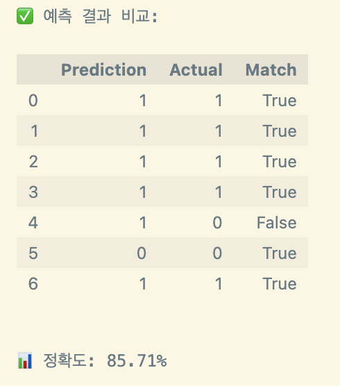

# 🎓 대학교 수강 이탈 예측 모델링

# 🔍 프로젝트 개요

## 🏃‍♂️ 팀원 소개
- **SK 네트웍스 Family AI 캠프 11기**

- **팀명:** **6조**
---

|[@백미송](https://github.com/misong-hub)|[@김성지](https://github.com/kimseoungji0801)|[@이채은](https://github.com/chaeeunlee05)|[@이혜성](https://github.com/comet39)|[@홍성욱](https://github.com/Sung-WookHong)|
|------|------|------|------|------|
|  |  |  |  |  |

## 📅 개발 기간
**2025년 3월 31일** ~ **2025년 4월 1일**


## 📌 프로젝트 목표
- 대학교 수강생들의 이탈(수강 취소) 여부를 조기 예측하여 학습 지원 및 개입 방안 마련<br/>
- 학생들의 과제 제출 패턴 및 성적 특성을 분석하여 이탈 징후를 파악<br/>
- 머신러닝 모델을 통해 이탈 위험군을 사전에 식별하고 예측 성능을 극대화<br/>

## 🌟 기대 효과
- 이탈 가능성 높은 학생을 조기에 파악함으로써 맞춤형 학습 지원 제공 가능<br/>
- 교육 기관의 학업 성공률 및 수료율 향상<br/>
- *과제 기반 행동 데이터만으로도 충분한 예측 성능을 확보함으로써 효율적인 데이터 수집 및 분석 체계 구축 가능*<br/>

## 🛠️ **접근 방식**
- Open University의 실제 데이터셋(OULAD) 활용
- 과제 제출율, 과제 점수 분위수, 평균 성적 Z-점수 등을 주요 피처로 활용
- 수강생의 이탈 여부(Withdrawn) 를 타겟 변수로 설정
- 데이터 전처리 및 피처 엔지니어링을 통해 날짜 정보, 제출 시기, 등록 시기 등을 범주화하여 반영
- Logistic Regression, Random Forest 등의 분류 모델을 적용
-최종적으로 모델 성능을 평가하고 이탈 예측에 가장 영향력 있는 변수 분석

## 🔧 기술 스택

<p align="center">
  
  
  
</p>

---

# 📂 데이터셋
[Open University Learning Analytics Dataset (OULAD)](https://analyse.kmi.open.ac.uk/#open-dataset) <br/>
오픈 유니버시티(Open University)에서 공개한 영국 Open University 학생들의 **온라인 학습 행동 및 이탈 관련 데이터셋**.<br/>
학습자의 활동, 평가 성적, 이탈 여부 등 **교육 분석(learning analytics)** 연구에 유용하게 쓰이는 대표적인 공개 데이터

## 데이터 구성 (5개의 CSV 파일)

1. `assessments.csv` : 각 강의의 과제(평가) 관련 정보 <br/>
2. `studentAssessment.csv`: 학생들의 과제 제출 및 성적 정보 <br/>
3. `courses.csv`: 개설된 각 강의(course)에 대한 정보 <br/>
4. `studentInfo.csv` : 각 학생의 인구통계학적 정보와 수강 결과 <br/>
5. `studentRegistration.csv`: 학생들의 수강 신청 및 이탈(취소) 정보 <br/>
   
    ↪️ **`merged_data.csv`** : 분석과 모델링에 필요한 주요 정보를 포함한 최종 분석용 데이터셋.  <br/>
   -5개의 csv 파일을 `학생 ID(id_student)`, `과목 코드(code_module)`, `학기(code_presentation)`를 기준으로 병합 <br/>
   

   
## 🎯 **타겟 변수**: **`수강취소여부`** 
- Yes → 수강을 취소한 학생 (이탈)
- No → 수강을 완료한 학생 (비이탈)

---

# 🧹 데이터 전처리(Data Preprocessing)

## 1. 결측치 처리

### `date`

- 대부분 `assessment_type = "Exam"`에 해당
- 시험은 일반적으로 강의 종료일에 시행됨
→ `module_presentation_length`를 활용해 **강의 마지막 날짜로 채움**


### `score`

- 총 173건 결측
    - `Withdrawn`(이탈자): 72개
    - `Pass`, `Fail`, `Distinction`(수료자): 101개
- 과제를 제출했는데도 점수가 없는 경우로 추정… 수가 적으므로 **삭제 처리**

### `imd_band`

- 총 7697건 결측
- 전체 28,785명 중 약 **971명**의 `imd_band`(지역 기반 사회경제 수준 지표)가 없음
- 'imd_band' 컬럼에서 결측치가 있는 행을 삭제


### `date_unregistration`

- 결측치 160,857건
- 해당 컬럼은 **"언제 수강을 중도 이탈했는가"**를 의미
- - 수강 등록일이 없는 7건 → **삭제**
→ **결측 = 중도 이탈하지 않은 수료자**
→ 즉, 의미 있는 결측이므로 **삭제하지 않음** → 인코딩 과정에서 결측치를 처리 한다!!!

### `final_result 이상치 처리 코드`


- **`date_unregistration`**: 이 필드는 학생이 온라인 학습을 이탈한 날짜를 나타냅니다. 학생이 학습을 중단하거나 수업을 탈퇴한 시점을 추적할 수 있습니다.

- **`final_result`**: 이 필드는 학생의 최종 성적 결과를 나타냅니다. 다만, **`date_unregistration`**이 존재하는 경우(즉, 학생이 온라인 학습을 이탈한 경우), 해당 학생은 **`Fail`** 상태로 결과가 나오지 않도록 처리되었습니다. 이유는 학습 이탈이 성적에 영향을 미치므로, 이탈 학생에게는 `Fail` 값을 부여할 수 없기 때문입니다.

### 처리 방식

- **학습 이탈**: `date_unregistration` 값이 존재하는 학생은 학습을 중단한 것으로 간주되며, 이들은 더 이상 학습을 지속하지 않으므로 **`Fail`** 상태로 처리될 수 없습니다.
  
- **이탈 학생 제외**: `final_result` 값이 `Fail`로 설정될 수 없는 이유는, `date_unregistration`에 의해 이미 이탈한 학생은 성적이 `Fail`로 기록되지 않기 때문입니다.

따라서, **`date_unregistration`** 값이 존재하는 학생은 `final_result` 값이 **`Fail`** 이 아니도록 예외 처리가 이루어집니다.


## 2.인코딩


### 불필요한 특성 제거
   - 분석에 불필요하거나 중복되는 정보를 가진 열 제거


## 3. 특성 엔지니어링
#### 학생의 성적 관련 특성
  - 각 학생의 평균 점수, 최고 점수, 최저 점수, 점수의 표준편차
    - 각 학생당 코스별 성적 편차 필요할까?
  - 점수 추세 (상승 또는 하락)
  - 과제 난이도에 따른 가중 점수 -> 난이도 기준을 뭘로 잡아야하나?
 
##### my_average_score, my_max_score, my_min_score, my_score_std, my_score_trend, assesment_weight, weighted_score

- my_avg_score : 개인 학업 성취도 수준 파악
- my_max/min_score/my_score_std : 특정 과목 강점/약점 식별 및 극단적 편차 분석
- my_score_trend	: 학습 효과성 평가 (지속적 상승=효율적 학습법, 하락=개입 필요)
- weighted_score :	난이도 대비 성취도 → "B과제는 고난이도지만 고가중점수 → Distinct 학생" 


## 4. StandardScaler 적용 (정규화)
- 수치형 변수에 대해 표준화 또는 정규화 적용

---

# 📊 탐색적 데이터 분석 (EDA)

## 히트맵(상관행렬)을 분석

- 히트맵(상관행렬)을 분석했을 때, 특정 변수들 간의 선형적 상관관계(피어슨 상관계수)가 낮게 나왔지만, 여전히 타겟 변수와의 관계가 존재할 가능성이 있으면 비선형 상호작용을 탐색을 하기로 함

## 비선형 데이터 특성 중요도 분석 기법
### 1. Spearman 상관계수 시각화
- 비선형 관계를 가진 변수 간 순위 기반 상관성을 측정


### 2. RandomForestClassifier를 특성 중요도 시각화
- 여러 개의 결정 트리를 만들어 데이터를 학습하고, 각 특성이 예측에 얼마나 기여했는지를 계산


### 3. Kendall 상관계수 시각화
- 두 변수 간의 순위가 얼마나 일치하는지를 측정


### 4. GradientBoostingClassifier를 통한 특성 중요도 시각화
- 특성 간의 복잡한 관계를 학습하며, 어떤 특성이 중요한지를 계산


---

# ⚙️ 모델링

## **모델링 개요**
### 🚨 학생 이탈 조기 예측

1. 앙상블, 클러스터링을 통해 기본적인 이탈 예측 모델을 생성한다.
2. 협업 필터링을 통해 새로운 학생과 유사한 패턴을 보이는 학생들을 추출한다.
    - 이때 새로운 학생의 정보가 어디까지 있어야 협업 필터링이 유의미할지는 eda를 통해 도출
        - **학생 기본 데이터** : 나이, 성별, 경제수준, 장애여부 등
        - **학업 데이터**: 과제 제출률, 시험 성적, 과목 난이도 등
        - **행동 데이터**: 지각 제출 비율, 이탈 학생의 이탈 단계 등
3. 만들어진 모델을 통해 새 학생이 어떤 조치를 했을 때 이탈을 하지 않을지 예측한다.
4. 추후 개발 : 자동 경고 시스템 구축 (예: 학습 참여도가 일정 임계값 이하로 떨어지면 교수자 및 학생에게 알림)

## **클래스 불균형 문제**

- **클래스 0 (비이탈자)** 는 잘 맞추고 있음 (recall=1.00).
- **클래스 1 (이탈자)** 는 recall이 0.28, 즉 이탈자를 정확히 잡아내지 못하고 있음.
- 전반적으로 **정확도 95%** 는 높지만, 이는 다수 클래스인 0에 의존한 착시.

   ### ⬆️ 오버샘플링
   - 클래스 불균형 처리: SMOTE를 통해 **이탈자 수(1)** 를 오버샘플링하여 균형 잡힌 학습 데이터셋 구성
     
     
   
   - recall이 0.28 → 0.52로 크게 상승 → **이탈자를 훨씬 더 많이 잡아냄.**
   - precision은 줄었지만 이는 이탈자 예측을 더 시도했기 때문에 자연스러운 현상.
   - f1-score도 올라서 **균형 잡힌 예측 성능 향상.**
   
   
   ### ⬇️ 언더샘플링
   - 클래스 불균형 처리: **언더샘플링**으로 **이탈자 수(1)** 에 맞춰 비이탈자 수 조정

### 2. 클러스터 기반 분류 모델

#### 📌 개요
클러스터 기반의 이진 분류 모델을 사용하여 새로운 학생의 데이터가 들어왔을 때 이탈을 예측합니다. 비지도 학습(클러스터링)과 지도 학습(분류 모델)을 결합하여, 서로 다른 학생 그룹에 특화된 예측 모델을 생성하는 방식으로 설계되었습니다.

#### 👥 클러스터링 + 이진 분류 모델

- 앙상블 모델을 통한 최종 이진 분류 모델 선택 👉 **XGBoost**
     - 그래디언트 부스팅의 순차적 오류 수정
     - 클래스 불균형 대응력 (under sampling과의 시너지)
    - 이유.. 적기
```
1. 데이터 스케일링 
2. PCA를 통해 데이터를 2차원으로 축소 
3. 각 클러스터에 대해 별도의 XGBoost 모델 
4. 각 클러스터 id 기준으로 모델과 스케일러를 저장
```

#### 🪄 이탈 예측 프로세스
```
1. 새로운 학생 유입
2. 내 클러스터은 어디? (id)
3. 내 클러스터 id에 해당하는 모델을 사용
4. 새로운 학생의 최종 이탈 예측 확인
```

#### 📊 결과 분석
##### 클러스터 분포 통계 확인


##### 각 클러스터별 특징 중요도 분석


##### 클러스터 별 모델 학습
````
🚀 클러스터 4 모델 학습 시작...
리샘플링 후 클래스 분포:
final_result
0    2335
1    2335
Name: count, dtype: int64

📊 클러스터 4 성능:
              precision    recall  f1-score   support

           0       0.96      0.96      0.96       585
           1       0.40      0.41      0.41        39

    accuracy                           0.92       624
   macro avg       0.68      0.68      0.68       624
weighted avg       0.93      0.92      0.93       624
`````
`````
🚀 클러스터 2 모델 학습 시작...
리샘플링 후 클래스 분포:
final_result
0    26679
1    26679
Name: count, dtype: int64

📊 클러스터 2 성능:
              precision    recall  f1-score   support

           0       0.98      0.92      0.95      6670
           1       0.31      0.61      0.41       391

    accuracy                           0.90      7061
   macro avg       0.64      0.77      0.68      7061
weighted avg       0.94      0.90      0.92      7061
`````

##### 예측 실행 시 정확도



새로운 학생 데이터 30개에 대한 예측 정확도는 75%

#### 💡 클러스터링 모델 개선 

##### 개요
데이터의 특성과 클러스터링 알고리즘에 따라 클러스터 개수 및 PCA 컴포넌트 개수가 클러스터링 성능에 영향을 미칠 수 있어서 다음과 같은 시각화를 통해 최적의 파라미터를 탐색

##### 최적의 클러스터 개수 찾기(엘보우 메서드, 실루엣 분석 활용)

- 4~5개의 클러스터가 데이터 분류에 가장 적합

##### 최적의 PCA 컴포넌트 개수 찾기(실루엣 분석 활용)

- 2개의 PCA 컴포넌트를 사용할 때 가장 높은 Silhouette Score를 기록하므로, 이 경우가 최적의 선택

## 🎯 하이퍼파라미터 튜닝

### 1. 앙상블 (기본)
   - Voting 방식: Hard Voting
   → 로지스틱 회귀, DecisionTreeClassifier, XGBoost의 다수결 투표로 최종 예측을 결정하는 기본 앙상블 방식.
   ```python
   VotingClassifier(
       estimators=[
           ('lr_clf', LogisticRegression()),
           ('dt_clf', DecisionTreeClassifier()),
           ('xgb_clf', XGBClassifier())
       ],
       voting='hard'
   )
   ```
   

### 2. 앙상블 + GridSearchCV 
   - Voting 방식: Soft Voting + 하이퍼파라미터 튜닝(GridSearchCV)
   → 각 모델을 GridSearchCV로 튜닝한 후 soft voting 방식으로 예측 확률 평균을 기반으로 최종 예측을 수행.
   ```python
   # 4. Logistic Regression 튜닝
   lr_param_grid = {
       'C': [0.01, 0.1, 1, 10],
       'penalty': ['l2'],
       'solver': ['lbfgs'],
       'max_iter': [100, 500, 1000]
   }
   lr_grid = GridSearchCV(LogisticRegression(), lr_param_grid, scoring='f1', cv=3, verbose=1, n_jobs=-1)
   lr_grid.fit(X_train, y_train)
   best_lr = lr_grid.best_estimator_
   
   # 5. Decision Tree 튜닝
   dt_param_grid = {
       'max_depth': [5, 10, 15],
       'min_samples_split': [2, 5, 10],
       'criterion': ['gini', 'entropy']
   }
   dt_grid = GridSearchCV(DecisionTreeClassifier(random_state=42), dt_param_grid, scoring='f1', cv=3, verbose=1, n_jobs=-1)
   dt_grid.fit(X_train, y_train)
   best_dt = dt_grid.best_estimator_
   
   # 6. XGBoost 튜닝
   xgb_param_grid = {
       'n_estimators': [50, 100, 150],
       'max_depth': [3, 5, 7],
       'learning_rate': [0.01, 0.05, 0.1],
       'subsample': [0.7, 0.8, 1.0],
       'colsample_bytree': [0.7, 0.8, 1.0]
   }
   xgb_grid = GridSearchCV(XGBClassifier(use_label_encoder=False, eval_metric='logloss', random_state=42), xgb_param_grid, scoring='f1', cv=3, verbose=1, n_jobs=-1)
   xgb_grid.fit(X_train, y_train)
   best_xgb = xgb_grid.best_estimator_
   ```
   

### 3. 앙상블 + RandomizedSearchCV
   - Voting 방식: Soft Voting + 하이퍼파라미터 튜닝(RandomizedSearchCV)
   → 모델별로 랜덤 탐색 기반 튜닝(RandomizedSearchCV) 후 soft voting으로 예측 확률 평균을 활용하여 예측.
   ```python
   # 4. RandomizedSearchCV - Logistic Regression
   lr_param_dist = {
       'C': uniform(0.01, 10),
       'penalty': ['l2'],
       'solver': ['lbfgs'],
       'max_iter': [100, 300, 500, 1000]
   }
   lr_random = RandomizedSearchCV(
       estimator=LogisticRegression(),
       param_distributions=lr_param_dist,
       n_iter=20,
       scoring='f1',
       cv=3,
       verbose=1,
       n_jobs=-1,
       random_state=42
   )
   lr_random.fit(X_train, y_train)
   best_lr = lr_random.best_estimator_
   
   # 5. RandomizedSearchCV - Decision Tree
   dt_param_dist = {
       'max_depth': randint(3, 20),
       'min_samples_split': randint(2, 20),
       'criterion': ['gini', 'entropy']
   }
   dt_random = RandomizedSearchCV(
       estimator=DecisionTreeClassifier(random_state=42),
       param_distributions=dt_param_dist,
       n_iter=30,
       scoring='f1',
       cv=3,
       verbose=1,
       n_jobs=-1,
       random_state=42
   )
   dt_random.fit(X_train, y_train)
   best_dt = dt_random.best_estimator_
   
   # 6. RandomizedSearchCV - XGBoost
   xgb_param_dist = {
       'n_estimators': randint(50, 300),
       'max_depth': randint(3, 15),
       'learning_rate': uniform(0.01, 0.3),
       'subsample': uniform(0.7, 0.3),
       'colsample_bytree': uniform(0.7, 0.3)
   }
   xgb_random = RandomizedSearchCV(
       estimator=XGBClassifier(use_label_encoder=False, eval_metric='logloss', random_state=42),
       param_distributions=xgb_param_dist,
       n_iter=30,
       scoring='f1',
       cv=3,
       verbose=1,
       n_jobs=-1,
       random_state=42
   )
   xgb_random.fit(X_train, y_train)
   best_xgb = xgb_random.best_estimator_
   ```
   

### 4. 앙상블 + RandomizedSearchCV + LogisticRegression 정규화

   ```python
   lr_pipeline = Pipeline([
       ('scaler', StandardScaler()),
       ('model', LogisticRegression())
   ])
   lr_param_dist = {
       'model__C': uniform(0.01, 10),
       'model__penalty': ['l2'],
       'model__solver': ['lbfgs'],
       'model__max_iter': [100, 300, 500, 1000]
   }
   ```


## 📈 모델 평가 (최종)
- 학습 정확도 / 테스트 정확도
- classification_report: Precision / Recall / F1-score
- 오버피팅 여부 확인


## 💡 인사이트 및 결론
- 이탈자의 주요 특성 요약
- 가장 영향력 있는 변수 분석 (예: 점수 편차↑, 제출률↓, 지각률↑)
- 이탈 위험군 조기 예측 가능성
- 실무 적용 시나리오 제안
- 
## 한줄 회고


